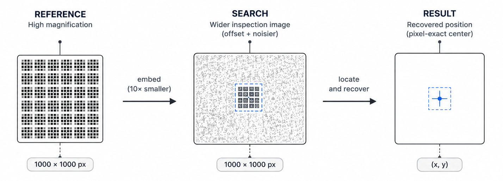
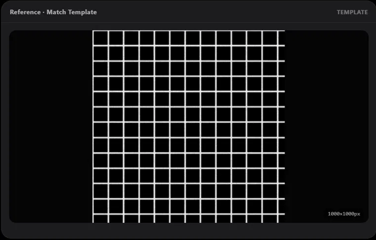
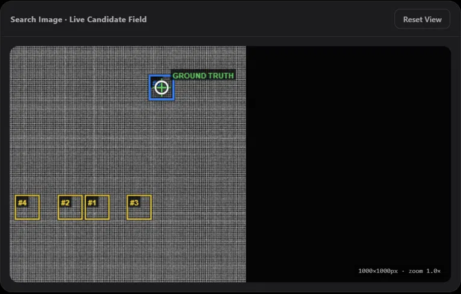
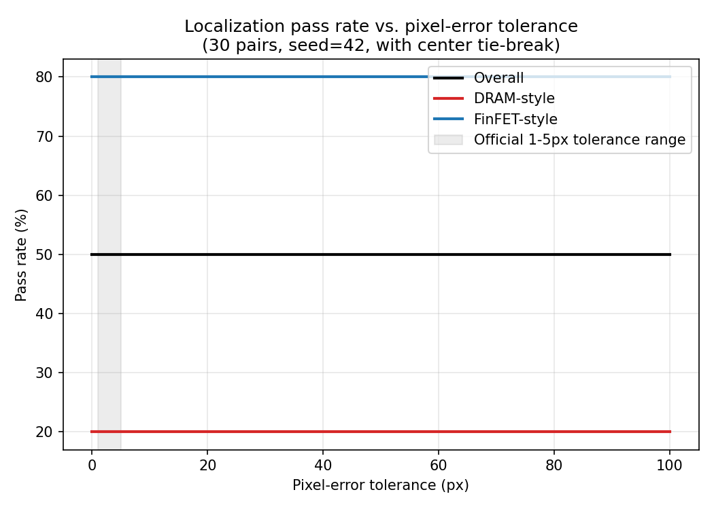
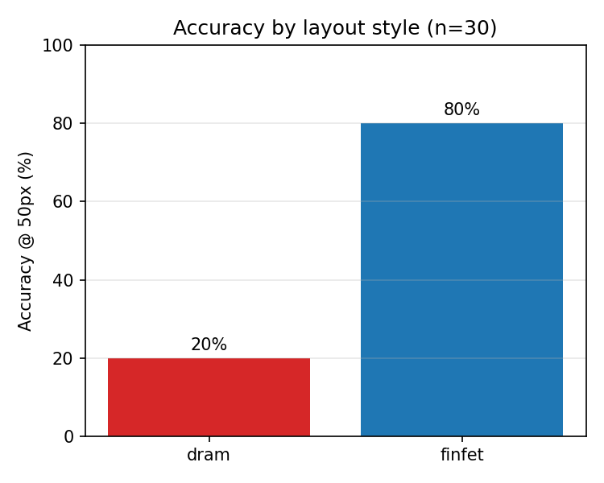

<div align="center">

# Drift-Sense
### Explainable Semiconductor Localization

**Applied Materials Problem Statement — i4C Semicon Hackathon 2026**  
*Team Gray Matter*

[](https://drift-sense-g88m.onrender.com/)
[](https://youtu.be/XV_wsmBUriw)
[](https://www.python.org/)
[](https://opencv.org/)

**[Try the live console →](https://drift-sense-g88m.onrender.com/)** &nbsp;|&nbsp;
**[Watch the walkthrough →](https://youtu.be/XV_wsmBUriw)**

*First load can take 30–60s — the free-tier instance sleeps when idle.*

</div>

---

## The problem

Semiconductor wafers are covered in thousands of nominally identical dies. Inspection tools return to the same relative site over and over, but stage drift, vibration, and thermal expansion mean they never land exactly where they should.

Drift-Sense recovers that lost position. Given a small, high-magnification **reference** image (the site the tool last knew correctly) and a wider, lower-magnification **search** image (roughly where the tool is now, offset and noisier), it finds the reference pattern inside the search image and returns its exact center — so the tool can recenter before the next high-resolution capture.

<p align="center">
  
</p>

What makes this hard isn't the search itself — it's that the layouts are periodic by design. DRAM and FinFET structures repeat every few pitches, so several locations in the search image can look almost identical to the reference. Landing close is easy. Landing on the **correct repeat**, among several equally plausible ones, is the actual problem.

---

## Demo & Prototype

### Live Prototype

**[drift-sense-g88m.onrender.com →](https://drift-sense-g88m.onrender.com/)**

The interactive console supports both curated evaluation cases and user-provided images. It exposes the localization process stage by stage rather than hiding the decision behind a single final coordinate.

### Demo Video

**[Watch the DriftSense walkthrough on YouTube →](https://youtu.be/XV_wsmBUriw)**

The demonstration covers successful localization, ambiguity detection, periodic DRAM patterns, candidate-generation failures, ranking/selection failures, and localization using a user-provided image.

The same deployed application shown in the video is available through the live prototype above.

---

## Try it yourself

We built a full interactive console around the real pipeline rather than just submitting a script and a results table. The live console lets you pick a curated example or upload and crop your own image, then watch the pipeline run stage by stage: candidate generation, NCC scoring, ORB/RANSAC verification, ranking, and final decision.

It calls the same `localization/` implementation used by the core pipeline — the web layer does not contain a separate localization algorithm.

<p align="center">
  
  
</p>

<p align="center"><i>A DRAM-style reference template (left) and the live candidate field in the search image (right). Four periodic look-alikes were generated and rejected (yellow); the correct repeat was verified and selected (blue, overlapping the ground-truth marker).</i></p>

If the live instance is asleep or you'd rather see the short version first:

**[Watch the walkthrough →](https://youtu.be/XV_wsmBUriw)**

---

## How it works

```text
DATASET GENERATION
Synthetic DRAM/FinFET layout → reference crop → search background + 10x embed (known x, y)
→ independent per-image sensor noise → blur / edge brightening / rotation

LOCALIZATION PIPELINE
Multi-scale (0.07–0.15) × multi-rotation (±4°) NCC template matching
→ top-5 non-overlapping candidate peaks
→ ORB keypoints + RANSAC affine verification, per candidate
→ fused score (NCC + ORB inlier fraction)
→ center-distance tie-break, applied only to genuine near-ties (score gap ≤ 0.005)
→ (x, y) + confidence + ambiguous flag
```

A periodic layout will always produce more than one strong intensity peak, so keeping only the top NCC score and trusting it fails predictably — the pipeline keeps the top 5 and verifies each one instead.

Verification means ORB keypoints plus a RANSAC affine fit, checking whether a candidate is structurally consistent with the reference rather than just similarly bright, which is what actually separates a real match from a lookalike repeat.

When the top candidates come out statistically indistinguishable, the pipeline flags that instead of picking one and staying quiet about it.

The official center-distance tie-break rule got tested rather than assumed. Applied loosely — candidates within 0.08 of each other treated as tied — it overrode already-correct picks and accuracy dropped to 20%. Restricted to genuine near-ties (gap ≤ 0.005), it improved results from 14/30 to 15/30. Both runs are in `evaluation/results.json`.

Every noise and degradation choice in the dataset generator is cited against imaging literature rather than picked by feel — see [`docs/citations.md`](docs/citations.md).

---

## Results

30-pair self-generated test set, seed=42, fully reproducible via `evaluation/evaluate.py`.

| Metric | Value |
|---|---|
| Overall accuracy (≤5px, official threshold) | **50.0% (15/30)** |
| FinFET-style accuracy | **80.0% (12/15)** |
| DRAM-style accuracy | **20.0% (3/15)** |
| Mean / median / worst-case error | 226 / 90 / 748 px |
| Inference time | ~4–5 s/pair (CPU only) |

<p align="center">
  
  
</p>

The number that matters more than the 50% is what the error distribution looks like: pass rate is identical from 1px tolerance all the way to 100px. Every prediction is either pixel-exact or wrong by hundreds of pixels — there's no "close but slightly off" middle ground.

That means the localization step itself has no precision problem. The entire gap is candidate **selection** on periodic DRAM grids, and we traced it to a specific cause rather than leaving it as a number.

Running a per-candidate diagnostic on the 12 DRAM failures (`evaluation/diagnose_dram.py`), 8 never had the correct location in the top-5 shortlist at all — a candidate-generation miss, upstream of ranking. The other 4 had the correct candidate present but lost the ranking to a visually similar repeat by a small score margin.

We also tried the obvious fix — raising top-k from 5 to 15 — and it made accuracy worse (50% → 40%), which we measured, reverted, and wrote up rather than quietly dropped. Full breakdown in [`docs/failure_analysis.md`](docs/failure_analysis.md).

**On the accuracy number itself:** some other teams' repos report 80%+ on their own self-generated test sets. Ours is 50%, and we'd rather state that plainly than frame around it. What we can offer instead is a number that comes with a complete diagnostic trail — every failure traced to a specific stage, a documented experiment that didn't work, and a live console anyone can run their own inputs through to check the claim directly, rather than a table you have to take on faith.

---

## Roadmap

This submission is a deterministic, classical-CV baseline, and that was a deliberate choice: no labeled dataset was provided, classical CV gives a fully debuggable failure trail end to end, and the problem statement explicitly allows classical, learned, or hybrid approaches.

The architecture was built with the next step in mind rather than as a dead end, though — the diagnosed bottleneck is specific enough to aim directly at:

- **Learned candidate ranking.** The measured failure mode is DRAM candidate disambiguation, downstream of a mostly-fine candidate generator. A learned structural embedding, inserted after NCC candidate generation and evaluated head-to-head against the current ranking on the same 30-pair set, is the planned next step — not a wholesale replacement of a pipeline that already works for FinFET-style layouts.
- **A larger ablation study.** The current rotation/scale/noise/position sweep uses n=2 per condition, which we've been explicit is directional rather than conclusive. The harness (`evaluation/ablation.py`) already supports scaling this up.
- **Sub-pixel refinement and a proper distinctiveness signal** for periodic regions, likely via phase-correlation-based scoring.

See `docs/failure_analysis.md` for the full reasoning behind this priority order.

---

## Quickstart

```bash
git clone https://github.com/hritvijtomar/Drift-sense.git
cd Drift-sense
pip install -r requirements.txt

# 1. Generate the synthetic dataset (30 pairs, DRAM + FinFET)
python3 generate_dataset.py --out_dir outputs --n_pairs 30 --seed 42

# 2. Run localization on a single pair — this is what gets benchmarked
python3 localize.py --reference outputs/reference/dram_002_ref.png \
                    --search outputs/search/dram_002_search.png

# 3. Full evaluation (accuracy, failure analysis, plots)
python3 evaluation/evaluate.py

# 4. Rotation/scale/noise/position ablation
python3 evaluation/ablation.py
```

`localize.py` takes exactly two path arguments and prints JSON —
`{x, y, confidence, ambiguous, runtime_sec, candidates_considered}` —
with no manual edits required, on a fresh checkout.

**Or run the web console locally instead of the CLI:**

```bash
pip install -r requirements.txt -r webapp/requirements.txt
python3 webapp/backend/app.py
# open http://localhost:5050
```

---

## Repository structure

```text
Drift-sense/
├── generate_dataset.py       # Top-level entry point → dataset/generator.py
├── localize.py               # Top-level entry point → localization/inference.py
│
├── dataset/
│   ├── layouts.py            # DRAM-style / FinFET-style clean layout generation
│   ├── degradation.py        # SEM-realistic noise / blur / edge brightening
│   └── generator.py          # Builds (reference, search, ground_truth) triplets
│
├── localization/
│   ├── template_matching.py  # Multi-scale/rotation NCC candidate generator
│   ├── feature_matcher.py    # ORB + RANSAC verification, ranking, center tie-break
│   └── inference.py          # Core pipeline: reference + search → (x, y)
│
├── evaluation/
│   ├── evaluate.py           # Runs inference on all pairs, scores accuracy + plots
│   ├── ablation.py           # Rotation/scale/noise/position ablation
│   ├── diagnose_dram.py      # Per-candidate diagnostic for every DRAM failure
│   └── results.json / summary.json / *.png / *.csv
│
├── docs/
│   ├── citations.md          # Every noise/augmentation choice, literature-cited
│   ├── failure_analysis.md   # Success + failure cases, full experiment history
│   └── screenshots/          # Console screenshots used in this README
│
├── webapp/                   # Interactive web console (Flask + SSE)
│   ├── backend/              # Web API + localization orchestration
│   └── frontend/             # Browser interface
│
├── outputs/                  # Generated dataset (reference/, search/, annotations/)
├── requirements.txt
└── README.md
```

---

## Technology

| | |
|---|---|
| Core algorithm | OpenCV (`cv2.matchTemplate` NCC, ORB, `estimateAffinePartial2D` RANSAC) |
| Web console | Flask + Server-Sent Events, vanilla JS frontend |
| Deployment | [Render](https://render.com), free tier |
| Training data / GPU | None — fully classical, deterministic inference |
| Dependencies | `opencv-python`, `numpy`, `matplotlib` for the core pipeline |

No model weights, no CUDA, no API keys. `pip install -r requirements.txt` and it runs anywhere.

---

## References

Every synthetic-data and algorithmic choice is backed by public literature, with a full per-item justification in [`docs/citations.md`](docs/citations.md). A few highlights:

- Reimer, L. (1998). *Scanning Electron Microscopy: Physics of Image Formation and Microanalysis*, 2nd ed. Springer.
- Goldstein, J. et al. (2018). *Scanning Electron Microscopy and X-Ray Microanalysis*, 4th ed. Springer.
- Itoh, K. (2001). *VLSI Memory Chip Design*. Springer.
- Colinge, J.-P. (ed.) (2008). *FinFETs and Other Multi-Gate Transistors*. Springer.
- Rublee, E. et al. (2011). ORB: An efficient alternative to SIFT or SURF. *ICCV*.
- Fischler, M. A. & Bolles, P. (1981). Random sample consensus. *Communications of the ACM*.

---

## Team Gray Matter

**Team Leader:** Bhavy Jain  
**Members:** Abhishek Sharma · Hritvij Tomar

National Institute of Technology, Delhi

<div align="center">

---

**[Live Demo](https://drift-sense-g88m.onrender.com/)** ·
**[Video Walkthrough](https://youtu.be/XV_wsmBUriw)** ·
**[Failure Analysis](docs/failure_analysis.md)** ·
**[Citations](docs/citations.md)**

Drift-Sense — Applied Materials Problem Statement — i4C Semicon Hackathon 2026

</div>